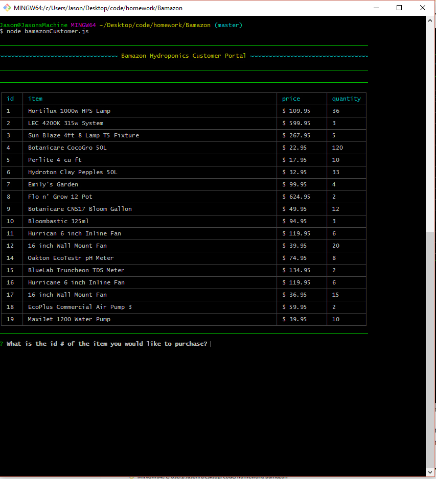
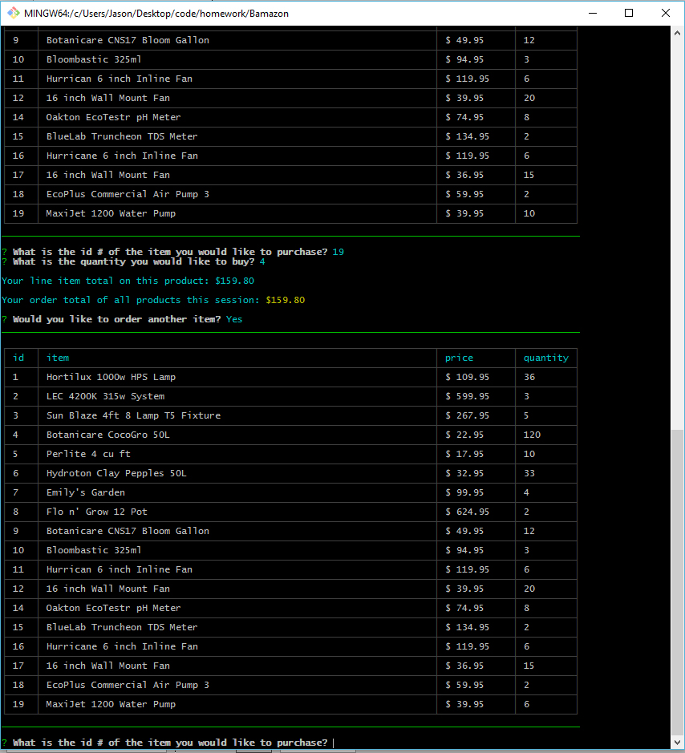
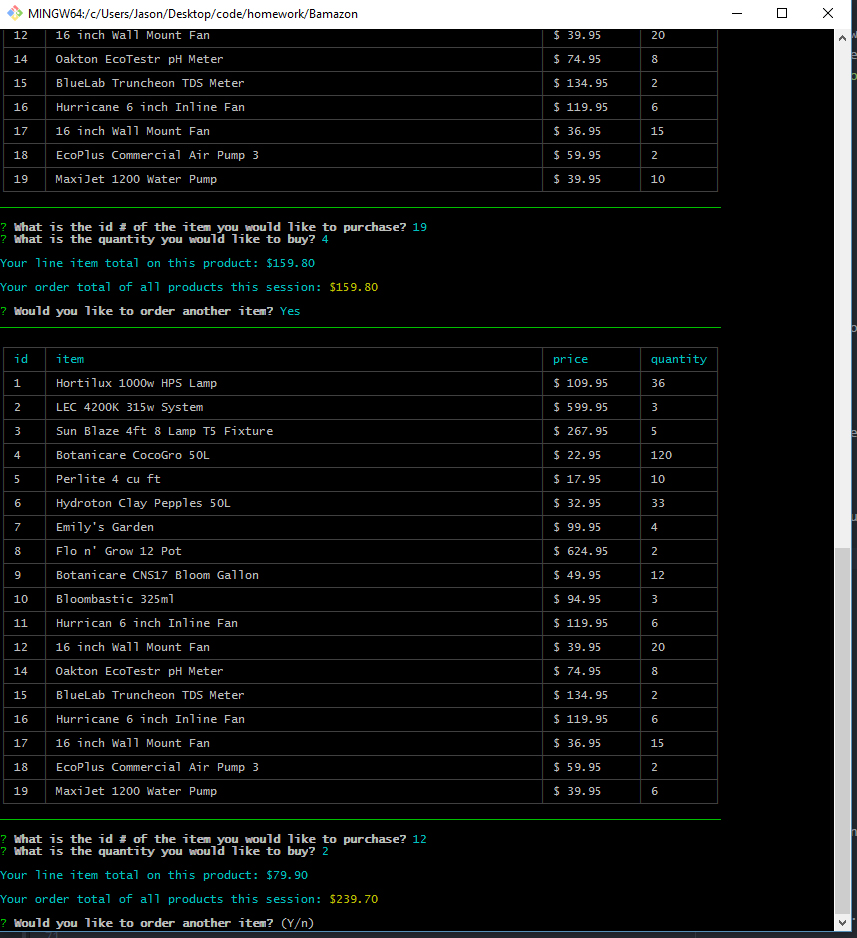
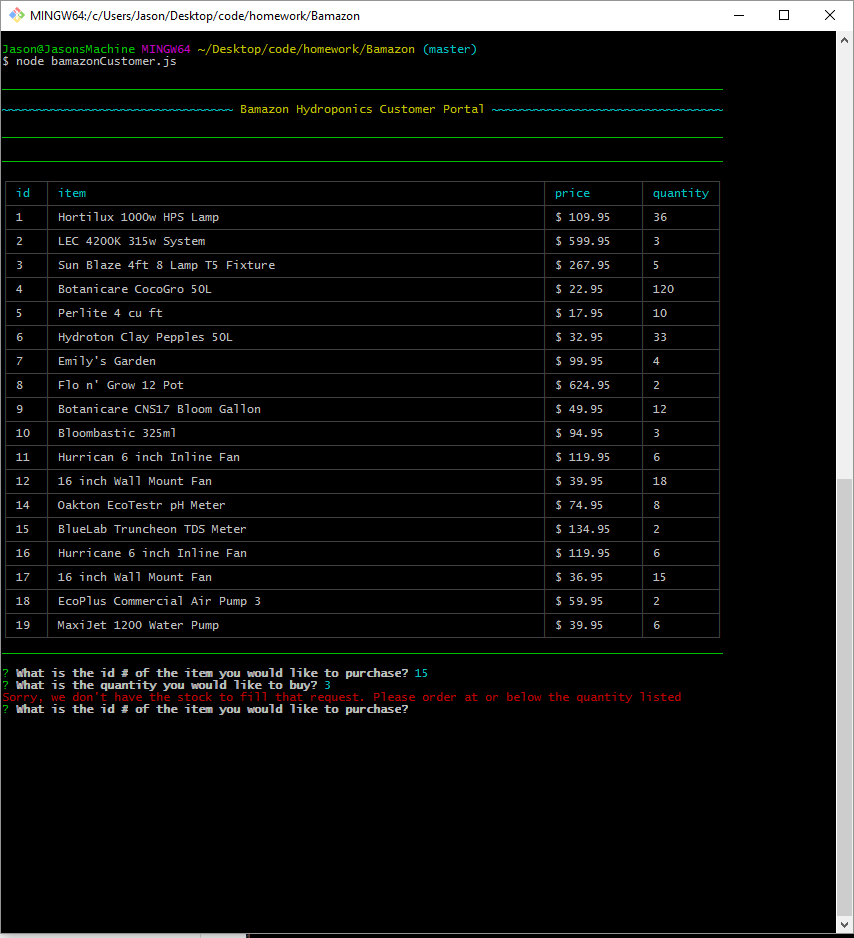
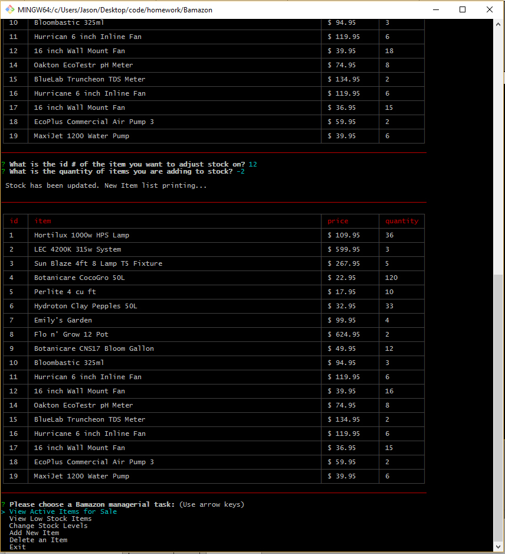

# Bamazon CLI Store App

## UCF Coding Bootcamp Week 12 Project (Node.js & MySQL)

---

### Overview

In this activity, I created an Amazon-like storefront with the MySQL methods I've learned in the last week. The app takes in orders from customers and depletes stock from the store's inventory. As a bonus task, I programed the app to track product sales across the store's departments and then provides a summary of the highest-grossing departments in the store.

## Installation Instructions

1. Fork this repo and clone the forked repo to your computer.
2. Run `npm install`, this will install the npm dependencies from the package.json file.
3. Install mysql on your machine, if necessary -> https://www.mysql.com/
4. Set up your own localhost connection. In each of the `.js` files in this repo, update the connection settings as follows:

```javascript
var connection = mysql.createConnection({
  host     : 'localhost',
  user     : <enter your user information>,
  password : <enter your password>,
  database : 'Bamazon'
});
```

5. In mysql Workbench, import `schema.sql` and `schema-seeds.sql` from this repo and run them to upload the db onto your localhost.
6. From the command-line,
	* To interact as a customer, run `node bamazonCustomer.js` to enter the Customer Portal, and follow the prompts on-screen.
	* To update items and adjust stock, as would a manager, run `node bamazonManager.js` and follow the prompts on-screen.
	* To evaluate whole departments and to add new departments, as would a supervisor, run `node bamazonSupervisor.js` and follow the prompts on-screen.

---

## Screenshots

### Customer Portal

1. typing `node bamazonCustomer.js` brings up the available items list and starts the prompts.



2. Answer the prompt with the id of the item you want to buy, then the quantity. Bamazon will give you your order total cost and then ask if you want to order another item. Answering `y` will bring up an updated item list and reprompt for another sale, answering `n` will exit the app.



3. If the customer keeps ordering the order total will show the cost of all different products ordered within the session.



4. If the customer tries to order more than the current stock level a message appears and then the customer is asked to re-enter their order request.



### Manager Portal

1. typing `node bamazonManager.js` brings up the menu of managerial task options.

      * View Active Items for Sale
      * View Low Stock Items
      * Change Stock Levels
      * Add New Item
      * Delete an item
      * Exit


2. Choosing _View Active Items for Sale_ will bring up the updated list of active items showing id, name, price & quantity of each item in the products table.


3. Choosing _View Low Stock Items_ will show a table of all items whose stock level has gone below 5.


4. Choosing _Change Stock levels_ will show an updated item list and ask for the id of the item you want to change. You can use negative or positive numbers.


when finished Bamazon will show the updated Item list with the stock change taken into effect.



5. Choosing _Add New Item_ will prompt the user for the new products name, retail price, department & initial stock quantity. It will then display an updated Item list with the new item included.


6. Choosing _Delete an Item_ will prompt the user for the item id of the product to delete, then it asks for a confirm since delete is permanent. If `Y` then the delete goes through, if `n` then it takes the user back to the menu.


6. Choosing _Exit_ will exit the application and bring the user back to the command prompt.

### Supervisor Portal

* work in progress

1. Create a new MySQL table called `departments`. Your table should include the following columns:

   * department_id

   * department_name

   * over_head_costs (A dummy number you set for each department)

   * total_sales

2. Modify the products table so that theres a product_sales column and modify the `bamazonCustomer.js` app so that this value is updated with each individual products total revenue from each sale.

3. Modify your `bamazonCustomer.js` app so that when a customer purchases anything from the store, the program will calculate the total sales from each transaction.

   * Add the revenue from each transaction to the `total_sales` column for the related department.
   * Make sure your app still updates the inventory listed in the `products` column.

4. Create another Node app called `bamazonSupervisor.js`. Running this application will list a set of menu options:

   * View Product Sales by Department
   * Create New Department

5. When a supervisor selects `View Product Sales by Department`, the app should display a summarized table in their terminal/bash window. Use the table below as a guide.

| department_id | department_name | over_head_costs | product_sales | total_profit |
| ------------- | --------------- | --------------- | ------------- | ------------ |
| 01            | Electronics     | 10000           | 20000         | 10000        |
| 02            | Clothing        | 60000           | 100000        | 40000        |

6. The `total_profit` should be calculated on the fly using the difference between `over_head_costs` and `total_sales`. `total_profit` should not be stored in any database. You should use a custom alias.

7. If you can't get the table to display properly after a few hours, then feel free to go back and just add `total_profit` to the `departments` table.

   * Hint: You may need to look into aliases in MySQL.

   * **HINT**: There may be an NPM package that can log the table to the console. What's is it? Good question :)

- - -
## Known Issues & TODO Items

  * Need to build out the Supervisor logic

- - -

## Copyright

Jason O'Brien (C) 2017.
